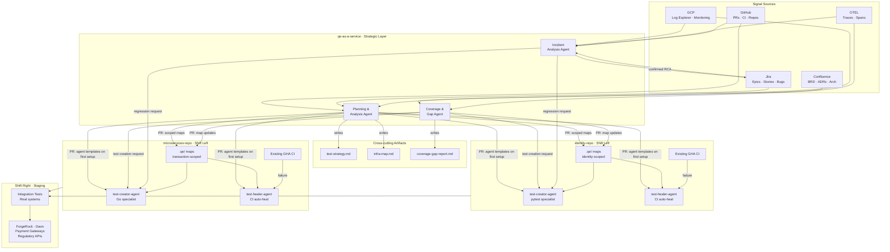
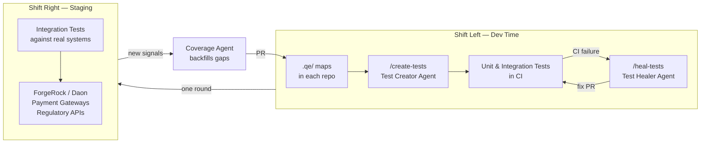
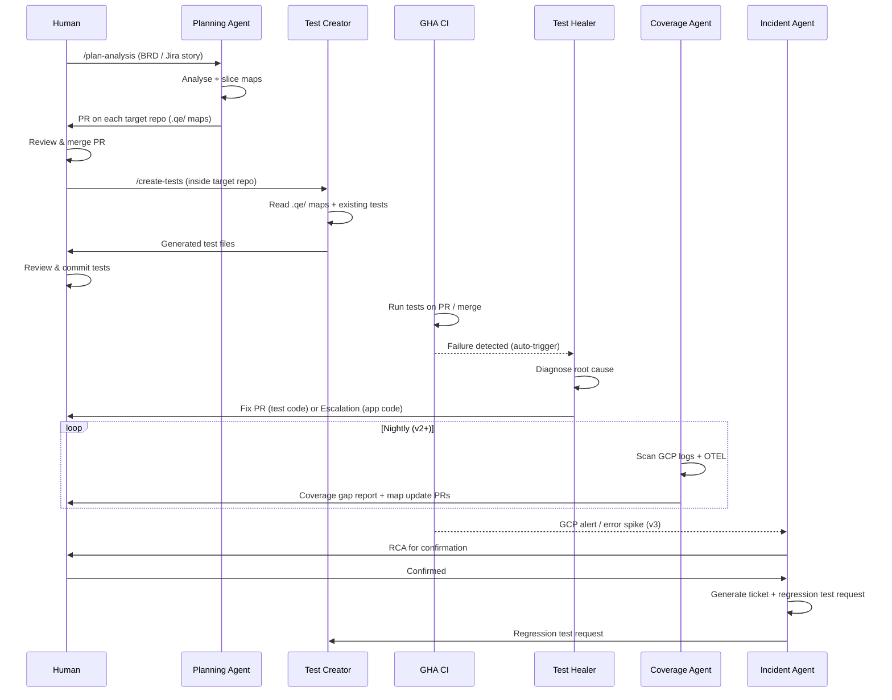
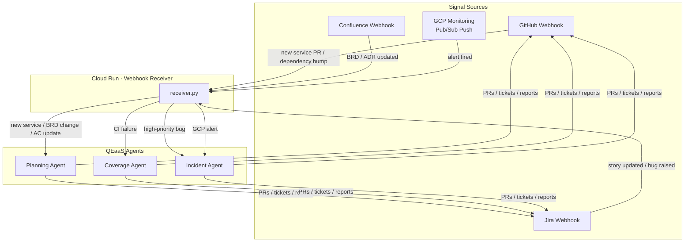

# QEaaS — Quality Engineering as a Service

A multi-agent QE framework for finance-sector systems, built on Claude Code. Operates across the full software lifecycle — from requirements analysis through production incident response — with finance-specific constraints baked in at every layer.

---

## Architecture

### Full System Overview



---

### Shift-Left / Shift-Right Model



---

### Agent Interaction & Data Flow



---

### v3 Webhook-Driven Automation



---

## Versions

| Version | What's included | Trigger mode |
|---|---|---|
| **v1** | Planning Agent, Test Creator Agent, Test Healer Agent | Manual slash commands |
| **v2** | + Coverage Agent, Incident Agent, auto-heal on CI failure, nightly scan | Manual + scheduled GHA |
| **v3** | + Webhook receiver on Cloud Run — fully event-driven | Fully automated |

---

## Agent Reference

### In `qe-as-a-service` (Strategic Layer)

| Agent | Command | Trigger | Output |
|---|---|---|---|
| Planning & Analysis | `/plan-analysis` | BRD, Jira story, arch diagram | Sliced `.qe/` maps via PR on each target repo |
| Coverage & Gap | `/coverage-gap` | Manual or nightly at 03:00 UTC | Gap report, map update PRs, test creation requests |
| Incident Analysis | `/incident-rca` | Manual or GCP alert (v3) | Confirmed RCA, Jira ticket, regression test request |

### In Each Target Repo (Shift Left)

| Agent | Command | Trigger | Output |
|---|---|---|---|
| Test Creator | `/create-tests` | Manual after `.qe/` maps merged | pytest / Go test files in existing test dirs |
| Test Healer | `/heal-tests` | Manual or auto on CI failure (v2+) | Fix PR or escalation |

---

## Repo Structure

```
qe-as-a-service/
├── CLAUDE.md                          # Master orchestrator prompt
├── .mcp.json                          # MCP server stubs (add credentials)
├── .claude/
│   ├── agents/
│   │   ├── planning-agent.md          # Slices maps, raises PRs
│   │   ├── coverage-agent.md          # GCP/OTEL gap analysis (v2)
│   │   └── incident-agent.md          # RCA + regression requests (v2)
│   └── commands/
│       ├── plan-analysis.md           # /plan-analysis
│       ├── coverage-gap.md            # /coverage-gap (v2)
│       └── incident-rca.md            # /incident-rca (v2)
├── .github/workflows/
│   └── nightly-coverage-scan.yml      # Scheduled coverage scan (v2)
├── artifacts/                         # Cross-cutting outputs
│   ├── test-strategy-template.md
│   └── infra-map-template.md
├── repo-templates/                    # PR'd into target repos on setup
│   ├── identity-repo/
│   │   ├── .qe/                       # Identity-scoped maps
│   │   ├── .claude/agents/            # pytest test-creator + healer
│   │   └── .github/workflows/         # Auto-heal (CI failure) +
│   │                                  # qe-create-tests-dispatched (v2 cross-repo)
│   └── microservices-repo/
│       ├── .qe/                       # Transaction-scoped maps
│       ├── .claude/agents/            # Go test-creator + healer
│       └── .github/workflows/         # Auto-heal + qe-create-tests-dispatched
├── target-repos/
│   ├── identity-repo.json             # ForgeRock/Daon repo config
│   └── microservices-repo.json        # Golang microservices config
├── webhooks/
│   └── receiver.py                    # Flask webhook receiver (v3)
└── deploy/cloud-run/                  # Cloud Run deployment (v3)
    ├── Dockerfile
    ├── service.yaml
    └── deploy.sh
```

---

## Finance-Specific Constraints

Applied by every agent, baked into every agent prompt:

| Constraint | Rule |
|---|---|
| Monetary values | `Decimal` always — never `float` or `float64` |
| PII fields | Synthetic/masked data only — never real customer data |
| Regulatory fields | Format, presence, and value validated at every layer |
| Audit trail | Completeness verified wherever applicable |
| KYC/AML flows | First-class test scenarios, not edge cases |
| Fraud signals | Velocity checks and pattern simulation in scope |
| Boundary conditions | Null, empty, min, max, zero, negative, future-dated, duplicate — all tested |
| Decimal precision | Per-currency decimal places (GBP: 2, JPY: 0, BHD: 3) |
| Regulatory impact | Flagged on all outputs where applicable |

---

## Getting Started

### Prerequisites
- Claude Code CLI installed
- MCP server packages available (`npm`, `npx`)
- GCP project with Log Explorer and Cloud Monitoring
- GitHub, Jira, Confluence access

### v1 Setup (Manual)

1. **Configure target repos** — fill in `target-repos/identity-repo.json` and `target-repos/microservices-repo.json`

2. **Configure MCP servers** — fill in credentials in `.mcp.json`:
   ```json
   GITHUB_PERSONAL_ACCESS_TOKEN, JIRA_API_TOKEN, CONFLUENCE_API_TOKEN,
   GCP_PROJECT_ID, GOOGLE_APPLICATION_CREDENTIALS
   ```

3. **Run Planning Agent** with a BRD or Jira story:
   ```
   /plan-analysis
   ```
   Planning Agent raises PRs on each target repo with scoped `.qe/` maps and agent definitions.

4. **Review and merge** the PRs on each target repo.

5. **Inside each target repo**, run:
   ```
   /create-tests
   ```

### v2 Setup (+ Operational Agents)

6. **Merge the GHA auto-heal workflow** from `repo-templates/<repo>/.github/workflows/qe-test-healer.yml` into each target repo.

7. **Add GitHub Actions secret** `ANTHROPIC_API_KEY` to each target repo.

8. **Enable nightly scan** — the `.github/workflows/nightly-coverage-scan.yml` in this repo runs automatically. Add required secrets:
   - `ANTHROPIC_API_KEY`
   - `GCP_PROJECT_ID`
   - `GCP_SA_KEY`

### v3 Setup (+ Full Automation)

9. **Deploy webhook receiver**:
   ```bash
   export GCP_PROJECT_ID=your-project
   cd deploy/cloud-run && ./deploy.sh
   ```

10. **Configure webhooks** in GitHub, Jira, Confluence, and GCP Cloud Monitoring pointing to the Cloud Run URL.

11. **Add secrets to Secret Manager**:
    - `anthropic-api-key`
    - `github-webhook-secret`
    - `jira-webhook-secret`

---

## MCP Servers

Configured in `.mcp.json`. Honest state of each integration:

| Server | Purpose | Status |
|---|---|---|
| GitHub | PR signals, repo changes, raise PRs | Wired — `@modelcontextprotocol/server-github` (stdio); set `GITHUB_PERSONAL_ACCESS_TOKEN` |
| Atlassian (Jira + Confluence) | Stories, AC, incident tickets, BRDs, ADRs | Wired — hosted SSE server at `https://mcp.atlassian.com/v1/sse`; auth via Claude Code's `/mcp` OAuth flow |
| GCP (Log Explorer, Cloud Monitoring) | Production signals for Coverage + Incident agents | **Not configured.** No widely-available official MCP server. Workarounds: paste log output / alert details when invoking agents, or wire a custom MCP server. |
| OTEL (traces, spans, latency) | Trace-driven gap analysis | **Not configured.** No widely-available official MCP server. Same workarounds. |

Agents are written to degrade gracefully when MCP tools are absent — every command prompt instructs them to "work with pasted input" if the relevant MCP is not connected.

---

## Human Approval Gates

The framework never autonomously merges code to target repos. Every output goes through a human review gate:

```
Planning Agent output  →  Human reviews .qe/ maps  →  Merge PR
Test Creator output    →  Human reviews test files  →  Commit tests
Incident RCA           →  Human confirms findings   →  Generate ticket + regression test
Coverage gaps          →  Human reviews map updates →  Merge PR
Test Healer fix        →  Human reviews fix PR      →  Merge (or: escalation reviewed)
```

The only autonomous action is the Test Healer raising a draft PR — it never merges without human approval.
