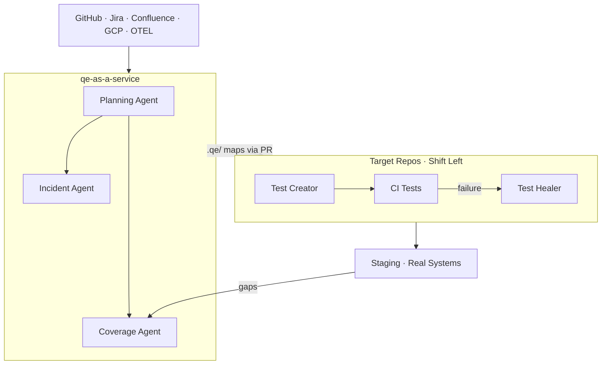
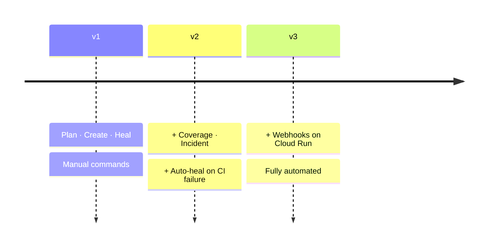

# QEaaS Architecture

## How It Works

```mermaid
flowchart TD
    Signals["GitHub · Jira · Confluence · GCP · OTEL"]

    subgraph QEaaS["qe-as-a-service"]
        PA[Planning Agent] --> CA[Coverage Agent]
        PA --> IA[Incident Agent]
    end

    subgraph Repos["Target Repos · Shift Left"]
        TC[Test Creator] --> CI[CI Tests]
        CI -->|failure| TH[Test Healer]
    end

    Staging["Staging · Real Systems"]

    Signals --> QEaaS
    QEaaS -->|".qe/ maps via PR"| Repos
    Repos --> Staging
    Staging -->|"gaps"| CA
```

---

## Versions

```mermaid
timeline
    v1 : Plan · Create · Heal
       : Manual commands
    v2 : + Coverage · Incident
       : + Auto-heal on CI failure
    v3 : + Webhooks on Cloud Run
       : Fully automated
```
