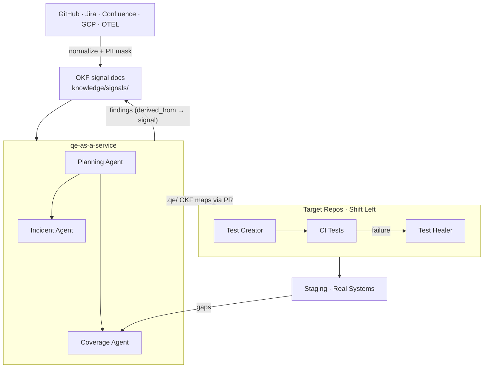
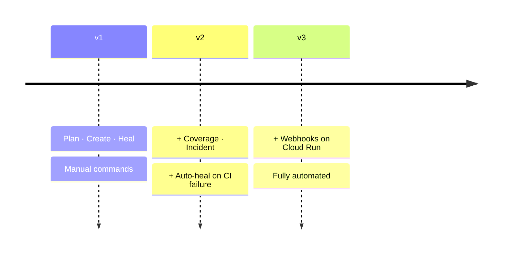

# QEaaS Architecture

## How It Works

Every arrow carries an OKF doc: markdown with typed frontmatter. Conventions are in [../okf/conventions.md](../okf/conventions.md), and the bundle entry point is [../knowledge/index.md](../knowledge/index.md).

---

## Versions

